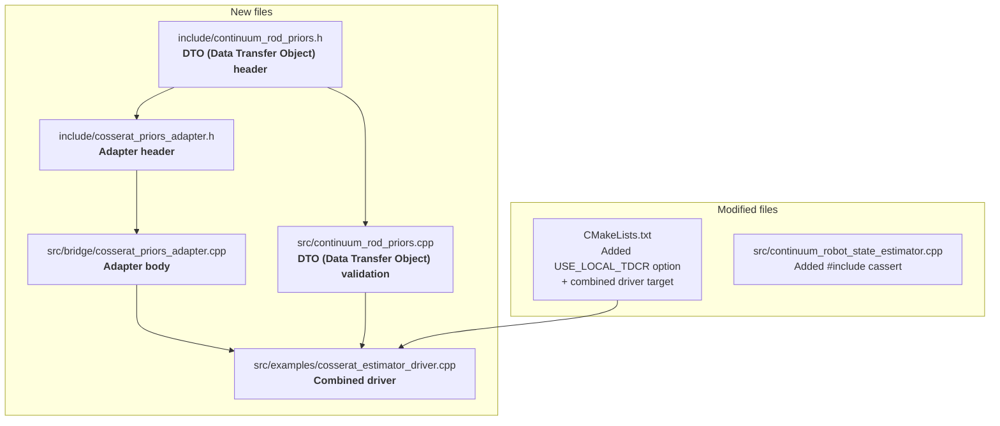
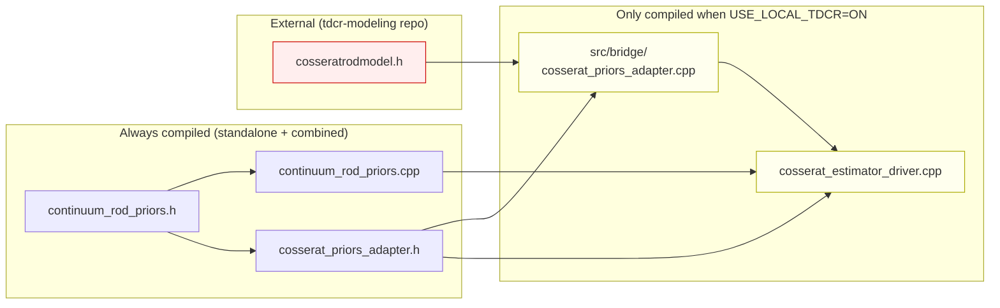

# Changes and New Files — Cosserat Integration

This document describes every file that was added or modified in the `Continuum-MultiRobot-Estimation` repository to enable the Cosserat rod model integration, what each file does, and how they connect.

The integration landed in two phases:

- **Phase A — Data pipeline** (commit `068fd4e`, §"New files — in detail" below): DTO + adapter-to-DTO + driver that prints the DTO.
- **Phase B — Estimator consumption** (branch `add-control-inputs`, §11 "Phase B additions" below): second adapter function that converts the DTO into estimator-ready inputs, scenario config, test suite, driver rewrite, and visualization wiring.

---

## Overview (Phase A)

Four new files were created, two existing files were modified. Nothing in the estimator's core algorithm changed — the integration is purely additive.



---

## New files — in detail

### 1. `include/continuum_rod_priors.h`

**What it is**: The data-transfer object (DTO) — a plain C++ struct that holds everything the estimator needs from a rod model.

**Why it exists**: The estimator should not include `cosseratrodmodel.h` or know anything about the Cosserat solver. Instead, any rod model (Cosserat, PCC, analytical) fills this struct, and the estimator reads it. This keeps the two repos decoupled.

**What it contains**:

```cpp
struct ContinuumRodPriors
{
    // Required: arclength samples and strains
    Eigen::VectorXd s;             // (N,)  arclength, e.g. [0, 0.01, 0.02, ..., 0.2]
    Eigen::MatrixXd v;             // (N,3) linear strain at each sample (body frame)
    Eigen::MatrixXd u;             // (N,3) angular strain / curvature (body frame)

    // Optional: derivatives
    Eigen::MatrixXd v_dot;         // (N,3) dv/ds
    Eigen::MatrixXd u_dot;         // (N,3) du/ds

    // Optional: internal resultants
    Eigen::MatrixXd n_internal;    // (N,3) R * K_se * (v - e3), world frame
    Eigen::MatrixXd m_internal;    // (N,3) R * K_bt * u, world frame

    // Optional: distributed loads from tendons
    Eigen::MatrixXd f_dist;        // (N,3) tendon force density, world frame
    Eigen::MatrixXd l_dist;        // (N,3) tendon moment density, world frame

    // Optional: concentrated loads at segment boundaries
    std::vector<double>          s_discrete;   // arclengths where point loads act
    std::vector<Eigen::Vector3d> F_discrete;   // force at each s_discrete
    std::vector<Eigen::Vector3d> L_discrete;   // moment at each s_discrete

    void validate() const;  // shape-consistency check
};
```

**Key properties**:
- Pure Eigen + STL. No dependency on any rod model.
- `s` and `v, u` are required (must be populated). All other fields are optional — leave them default-constructed (empty) if the model cannot produce them.
- `validate()` checks that all populated matrices have matching row counts and 3 columns, that `s` is monotonically non-decreasing, and that the three discrete-load vectors have the same length. Throws `std::invalid_argument` with a descriptive message on any mismatch.

**Who uses it**: The adapter (to fill it), the driver (to pass it around), and eventually the estimator (to read priors from it).

---

### 2. `src/continuum_rod_priors.cpp`

**What it is**: Implementation of `ContinuumRodPriors::validate()`.

**What it checks** (in order):
1. `s` is not empty.
2. `v` is exactly `(N, 3)` where `N = s.size()`.
3. `u` is exactly `(N, 3)`.
4. Each optional matrix (`v_dot`, `u_dot`, `n_internal`, `m_internal`, `f_dist`, `l_dist`): either empty (size 0, meaning "not populated") or exactly `(N, 3)`.
5. `s` is monotonically non-decreasing (no negative steps).
6. `s_discrete`, `F_discrete`, `L_discrete` all have the same length.

If any check fails, throws `std::invalid_argument` with a message saying which field failed and what shape was expected vs. found.

**Where it gets compiled**: Automatically picked up by `file(GLOB src/*.cpp)` in the existing `continuum_robot_viewer` target. Also explicitly listed in the `cosserat_estimator_driver` target.

---

### 3. `include/cosserat_priors_adapter.h`

**What it is**: Declaration of the adapter function that translates `CosseratRodModel` outputs into a `ContinuumRodPriors`.

**Full content**:

```cpp
#include "continuum_rod_priors.h"

class CosseratRodModel;   // forward-declaration only

ContinuumRodPriors priorsFromCosseratModel(const CosseratRodModel& model,
                                           double L1, double L2);
```

**Why the forward-declaration matters**: This header includes `continuum_rod_priors.h` (pure Eigen) but does NOT include `cosseratrodmodel.h`. The `CosseratRodModel` class is only forward-declared — enough for the compiler to accept a reference parameter without needing the full class definition. This means any file that includes `cosserat_priors_adapter.h` does NOT transitively pull in tdcr-modeling headers, keeping the estimator's include tree clean.

**Parameters**:
- `model` — a reference to a `CosseratRodModel` that has already run `forwardKinematics()` successfully.
- `L1, L2` — physical lengths of the two segments (needed to fill `s_discrete` with the junction and tip arclengths). For the default model, `L1 = L2 = 0.1`.

---

### 4. `src/bridge/cosserat_priors_adapter.cpp`

**What it is**: The adapter implementation — the ONLY file in this entire repo that includes `cosseratrodmodel.h`.

**Why it is in `src/bridge/` and not `src/`**: The estimator's CMakeLists has `file(GLOB CPP_FILES src/*.cpp)` which picks up every `.cpp` directly in `src/`. If the adapter were in `src/`, it would be compiled into every target — including standalone ones that don't link `tdcr_modeling`. Those builds would fail with "undefined symbol CosseratRodModel". Putting it in `src/bridge/` keeps it outside the glob. It is only compiled when explicitly listed in the `cosserat_estimator_driver` target (which links `tdcr_modeling`).

**What the function does**, step by step:

```
priorsFromCosseratModel(model, L1, L2):
    1. Create empty ContinuumRodPriors p
    2. Copy per-arclength data from model getters into DTO (Data Transfer Object) fields:
         p.s          = model.getArclengthSamples()    // (21,)
         p.v          = model.getStrainV()             // (21,3)
         p.u          = model.getStrainU()             // (21,3)
         p.v_dot      = model.getStrainVDot()          // (21,3)
         p.u_dot      = model.getStrainUDot()          // (21,3)
         p.n_internal = model.getInternalForce()       // (21,3)
         p.m_internal = model.getInternalMoment()      // (21,3)
         p.f_dist     = model.getDistributedForce()    // (21,3)
         p.l_dist     = model.getDistributedMoment()   // (21,3)
       Each getter returns a const Eigen::MatrixXd&.
       The assignment (=) does a deep copy — the DTO (Data Transfer Object) owns its data.
    3. Copy discrete loads:
         model.getDiscreteLoads(F_junction, L_junction, F_tip, L_tip)
         p.s_discrete = { L1, L1+L2 }           // e.g. { 0.1, 0.2 }
         p.F_discrete = { F_junction, F_tip }
         p.L_discrete = { L_junction, L_tip }
    4. Call p.validate() — if any shape is wrong, throws here
    5. Return p
```

**Error behavior**: If the model's FK didn't converge, the getters in step 2 throw `std::runtime_error` (from the model side). If shapes are inconsistent, `validate()` in step 4 throws `std::invalid_argument`. Either way, no bad data reaches the estimator.

---

### 5. `src/examples/cosserat_estimator_driver.cpp`

**What it is**: A standalone executable that runs the full pipeline end-to-end: Cosserat FK → adapter → DTO (Data Transfer Object) → print.

**What it does**:

```
main():
    1. Create a CosseratRodModel with default parameters
       (two 0.1 m segments, 10 disks each, NiTi backbone)
    2. Set tendon tensions: q = [0.5, 0.2, 0.0, 0.3, 0.0, 0.1] N
    3. Run forwardKinematics()
    4. If converged, call priorsFromCosseratModel(model, 0.1, 0.1)
    5. Print DTO (Data Transfer Object) dimensions, value ranges, and discrete loads
    6. Print "Pipeline OK"
```

**Purpose**: Proves that the build wiring works (both repos link together), the adapter copies data correctly, and `validate()` passes on real data. Not a test framework — just a smoke test.

**Build condition**: Only built when `USE_LOCAL_TDCR=ON`. Not compiled in the default standalone build.

---

## Modified files — in detail

### 6. `CMakeLists.txt`

**Two additions** (everything else unchanged):

**Addition 1** — after `find_package(yaml-cpp REQUIRED)`:

```cmake
option(USE_LOCAL_TDCR "Link against sibling tdcr-modeling checkout" OFF)

if (USE_LOCAL_TDCR)
    set(TDCR_ROOT "${CMAKE_CURRENT_SOURCE_DIR}/../tdcr-modeling/c++" CACHE PATH
        "Path to the c++ subdir of a tdcr-modeling checkout")
    if (NOT EXISTS "${TDCR_ROOT}/CMakeLists.txt")
        message(FATAL_ERROR "...")
    endif()
    add_subdirectory("${TDCR_ROOT}" "${CMAKE_BINARY_DIR}/tdcr_modeling_build")
endif()
```

This does nothing when `USE_LOCAL_TDCR=OFF` (default). When ON, it tells CMake to also build the tdcr-modeling library from the sibling directory. `TDCR_ROOT` defaults to `../tdcr-modeling/c++` but can be overridden with `-DTDCR_ROOT=<path>`.

**Addition 2** — at the end, a conditional target:

```cmake
if (USE_LOCAL_TDCR)
    add_executable(cosserat_estimator_driver
        src/examples/cosserat_estimator_driver.cpp
        ${H_FILES}
        src/continuum_robot_state_estimator.cpp
        src/continuum_rod_priors.cpp
        src/bridge/cosserat_priors_adapter.cpp   # explicitly listed — not glob'd
        src/config_loader.cpp
        src/utilities.cpp
    )
    target_link_libraries(cosserat_estimator_driver
        PRIVATE Eigen3::Eigen yaml-cpp::yaml-cpp tdcr_modeling)
endif()
```

Note `src/bridge/cosserat_priors_adapter.cpp` is listed explicitly here — it is never part of any other target.

**What stays untouched**: All three existing targets (`continuum_robot_viewer`, `test_config_loader`, `test_estimation`) are identical. Their source lists, link libraries, and output directories did not change.

---

### 7. `src/continuum_robot_state_estimator.cpp`

**One line added**: `#include <cassert>` at line 4.

**Why**: The file uses `assert()` throughout (for input validation) but never explicitly included `<cassert>`. In Debug builds, `assert` was transitively available through other headers. In Release builds (`-DCMAKE_BUILD_TYPE=Release`), it wasn't — causing compile failures. Adding the explicit include fixes both modes.

**What did NOT change**: No logic, no algorithm, no function signatures. The only diff is the one `#include` line.

---

## How the files relate to each other



The red box (`cosseratrodmodel.h`) is from the other repo. The yellow boxes are the only files that depend on it — and they are only compiled when the user opts in. Everything else (white boxes) compiles standalone.

---

## Directory structure after the changes

```
Continuum-MultiRobot-Estimation/
  CMakeLists.txt                            # modified: USE_LOCAL_TDCR option + driver target
  doc/
    changes_and_new_files.md                # this file
  include/
    config_loader.h                         # unchanged
    continuum_robot_state_estimator.h       # unchanged
    continuum_rod_priors.h                  # NEW — DTO (Data Transfer Object) definition
    cosserat_priors_adapter.h               # NEW — adapter declaration
    utilities.h                             # unchanged
    visualizervtk.h                         # unchanged
  src/
    bridge/
      cosserat_priors_adapter.cpp           # NEW — adapter body (USE_LOCAL_TDCR only)
    examples/
      continuum_robot_viewer.cpp            # unchanged
      cosserat_estimator_driver.cpp         # NEW — combined driver
    tests/
      test_config_loader.cpp                # unchanged
      test_estimation.cpp                   # unchanged
    config_loader.cpp                       # unchanged
    continuum_robot_state_estimator.cpp     # modified: +1 line (#include <cassert>)
    continuum_rod_priors.cpp                # NEW — DTO (Data Transfer Object) validate()
    utilities.cpp                           # unchanged
    visualizervtk.cpp                       # unchanged
```

Files marked **unchanged** have zero modifications. Files marked **NEW** were created from scratch. Files marked **modified** have minimal, targeted edits described above.

---

## 11. Phase B additions — connecting the DTO to `computeStateEstimate()`

The files above (Phase A) land the DTO and prove the cross-repo boundary works. Phase B (branch `add-control-inputs`) turns the DTO into three estimator-ready objects and actually runs the MAP solver against them.

### 11.1 Summary of what changed in Phase B

| File | Kind | Purpose |
|---|---|---|
| [`include/cosserat_priors_adapter.h`](../include/cosserat_priors_adapter.h) | extended | New `EstimatorPriors` struct + `cosseratPriorsToEstimator()` declaration |
| [`src/bridge/cosserat_priors_adapter.cpp`](../src/bridge/cosserat_priors_adapter.cpp) | extended | Body of `cosseratPriorsToEstimator()` — frame permutation, resampling, measurement / control-input / initial-guess construction |
| [`src/examples/cosserat_estimator_driver.cpp`](../src/examples/cosserat_estimator_driver.cpp) | rewritten | Now actually runs `computeStateEstimate()` and prints a per-node strain-agreement table; new `--visualize` and `--no-control-inputs` flags |
| [`config/6_cosserat_priors.yaml`](../config/6_cosserat_priors.yaml) | NEW | Single-robot scenario: `K=11`, `L=0.2 m`, `initial_guess: Custom`, measurements/control_inputs lists empty (filled at runtime) |
| [`src/tests/test_cosserat_adapter.cpp`](../src/tests/test_cosserat_adapter.cpp) | NEW | 4 validation tests — frame permutation, resampling, end-to-end convergence, prior-vs-no-prior A/B |
| [`CMakeLists.txt`](../CMakeLists.txt) | extended | New `test_cosserat_adapter` target; driver target gains `${VTK_LIBRARIES}` + `src/visualizervtk.cpp` (both only under `USE_LOCAL_TDCR`) |

### 11.2 New adapter API (additive — Phase A functions untouched)

```cpp
// Bundle of estimator-ready inputs produced by cosseratPriorsToEstimator().
struct EstimatorPriors {
    std::vector<ContinuumRobotStateEstimator::SensorMeasurement> measurements;
    std::vector<ContinuumRobotStateEstimator::ControlInput>      control_inputs;
    ContinuumRobotStateEstimator::SystemState                    initial_guess;
};

EstimatorPriors cosseratPriorsToEstimator(
    const ContinuumRodPriors&                          priors,
    const ContinuumRobotStateEstimator::RobotTopology& topology,
    unsigned int                                       robot_idx,
    const Eigen::MatrixXd&                             diskFrames);
```

Handles: (a) Cosserat z-forward → estimator x-forward body-frame permutation via `R_conv = [[0,0,1],[1,0,0],[0,1,0]]`, (b) arclength resampling from the 21-sample Cosserat grid to the estimator's K uniform nodes, (c) construction of `K` strain measurements + `K-1` `Constant` control inputs + a `SystemState` initial guess seeded from the permuted Cosserat disk frames.

Detailed walkthrough of this function is in [`bridge_adapter_guide.md`](bridge_adapter_guide.md) §4 — including the two estimator sign conventions the adapter must respect (strain double-negation that cancels; single control-input negation that does not).

### 11.3 Phase B headline result

From `./examples/test_cosserat_adapter config/6_cosserat_priors.yaml`:

| Run | Mean per-node strain error | vs no-prior |
|---|---|---|
| No priors (straight-rod MAP, no measurements) | 0.224 rad/m | 1× (baseline) |
| Cosserat priors (measurements + control inputs + custom guess) | 2.34 × 10⁻⁴ rad/m | **≈ 957× smaller** |

Full experimental protocol, per-component strain table, and convergence characteristics: [`cosserat_integration_results.md`](cosserat_integration_results.md).

### 11.4 Directory tree — Phase A + Phase B combined

```
Continuum-MultiRobot-Estimation/
  CMakeLists.txt                            # modified: USE_LOCAL_TDCR + driver + test target
  config/
    6_cosserat_priors.yaml                  # NEW (Phase B)
  doc/
    changes_and_new_files.md                # this file
    bridge_adapter_guide.md                 # NEW (Phase B) — runtime walkthrough of the adapter
    cosserat_integration_results.md         # NEW (Phase B) — empirical A/B results
  include/
    continuum_rod_priors.h                  # NEW (Phase A)
    cosserat_priors_adapter.h               # NEW (Phase A) — extended in Phase B
  src/
    bridge/
      cosserat_priors_adapter.cpp           # NEW (Phase A) — extended in Phase B
    examples/
      cosserat_estimator_driver.cpp         # NEW (Phase A) — rewritten in Phase B
    tests/
      test_cosserat_adapter.cpp             # NEW (Phase B)
    continuum_robot_state_estimator.cpp     # modified: +1 line (#include <cassert>)
    continuum_rod_priors.cpp                # NEW (Phase A)
```

All other files (listed in §"Directory structure after the changes" above) are unchanged in Phase B.
