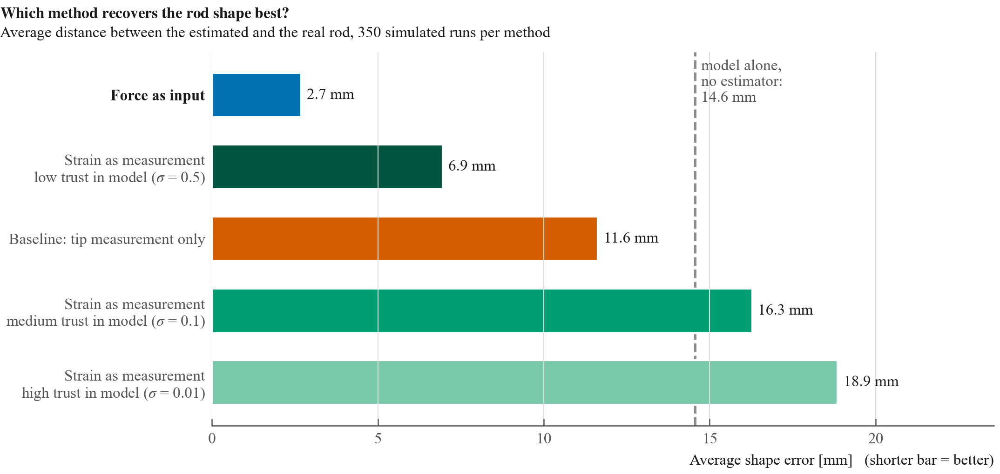
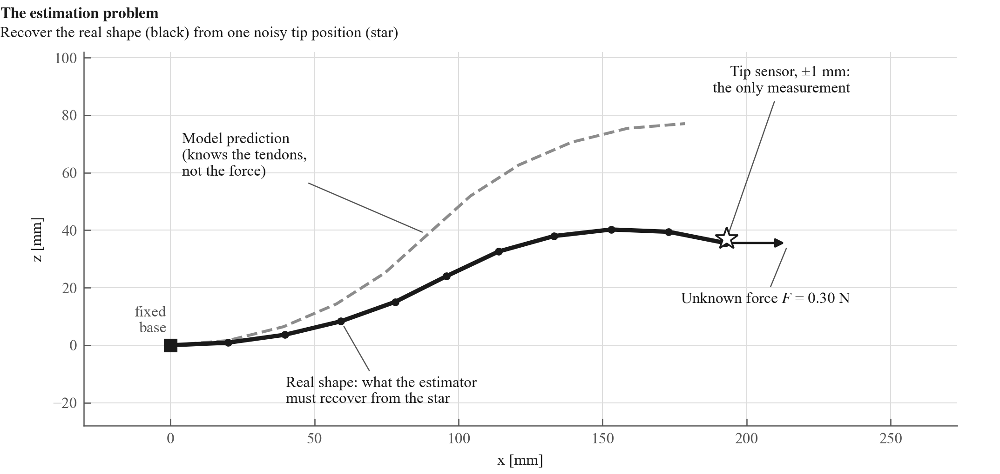
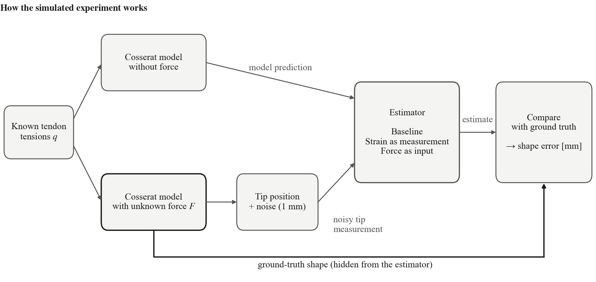
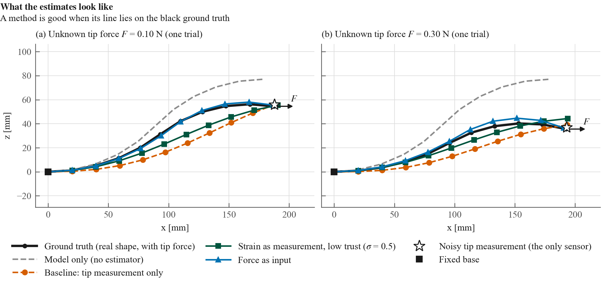
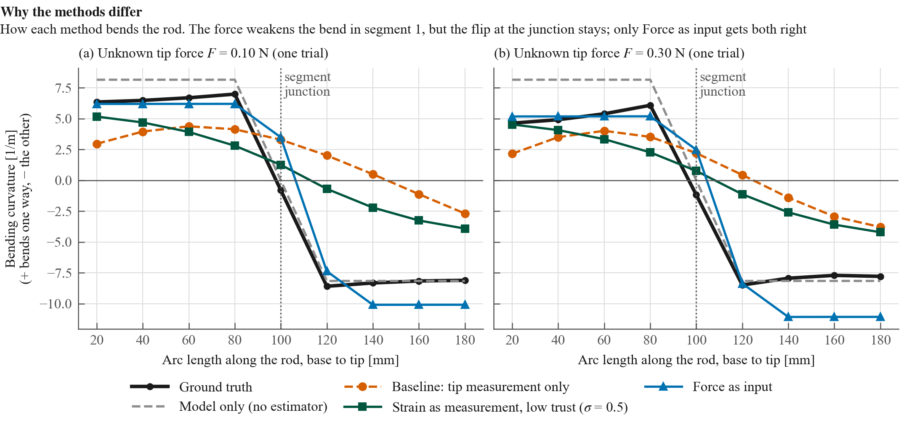
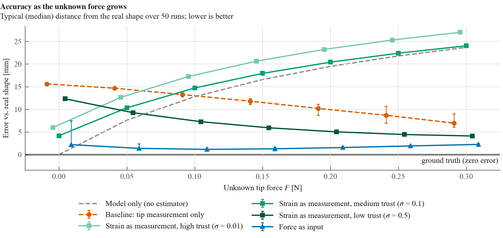
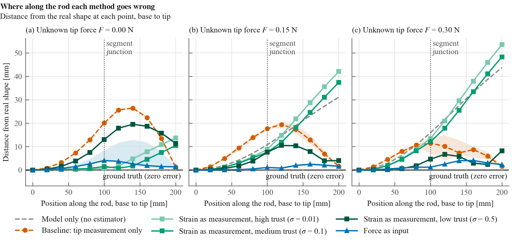
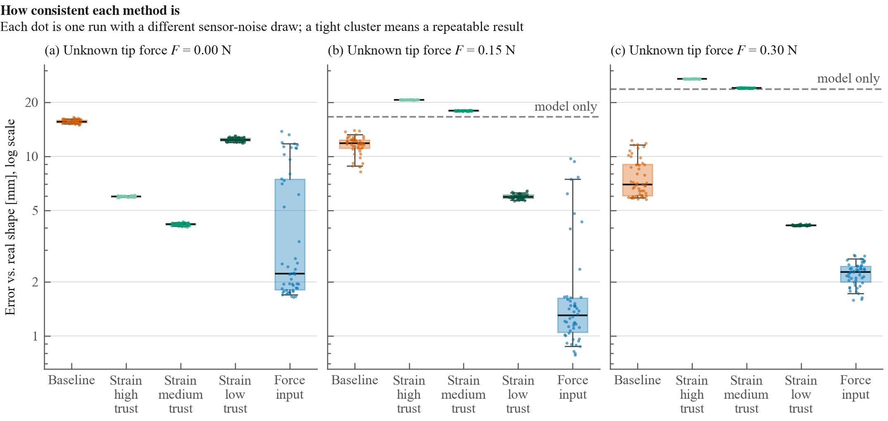
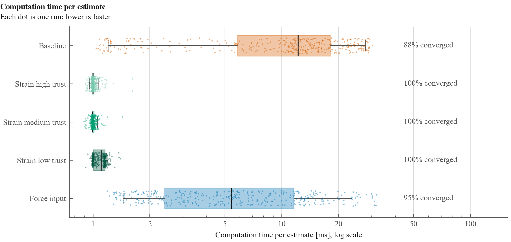

# Evaluation: Three Ways to Use a Physics Model in Shape Estimation

**Reproduce:** `python scripts/evaluate.py all` (Section 8)

A continuum robot is pushed by a force nobody measures. We know its tendon tensions (so a physics model can predict its shape) and we have one noisy sensor at its tip. We compare three ways of combining the two. Telling the estimator *how the bending changes along the rod* (**Force as input**) recovers the real shape to **2.7 mm** on average (1.7 mm in a typical run). That is 2.6–7× better than the alternatives, and needs no tuning. Its one weakness: in about 1 run in 8, mostly when the force is small, it finds a wrong shape that bows out of the bending plane.



*Figure 3 (shown first). How far, on average, each method's estimated rod is from the real rod; a shorter bar is better. Each bar averages 350 simulated runs (7 levels of unknown force × 50 sensor-noise draws). The dashed line is the model's prediction used on its own, without any estimator: bars that reach past it are worse than not estimating at all. The three green bars are the same method with different trust in the model.*

**At a glance**

- **Force as input is the most accurate.** Its typical (median) error is 1.2–2.3 mm at every force. In 44 of 350 runs it bows out of the plane (5–14 mm off); these are frequent with no force (17 of 50) and absent at the largest force.
- **Strain as measurement depends entirely on how much it trusts the model.** Trusting it a lot is worse than not estimating at all once the robot is pushed. Trusting it little gives 4–12 mm. No single setting is best.
- **The Baseline**, the tip sensor alone, gets a smooth curve through the tip but misses where the S flips: 16 mm with no force, improving to 8 mm as the force flattens the S.

Background terms (strain, prior, control input) are explained in [`cosserat_integration.md`](cosserat_integration.md), Sections 1–3. The rod physics is in [`tdcr-modeling/doc/cosserat_rod_model.md`](../../tdcr-modeling/doc/cosserat_rod_model.md).

---

## 1. What we are evaluating



*Figure 1. The estimation problem, drawn from real data. The gray dashed line is the model's prediction: it knows the tendon tensions but not the force. The black line is the real shape, pushed by an unknown force $F$ at the tip. The estimator only sees the star, a tip position with ±1 mm noise, and must recover the whole black line.*

A **tendon-driven continuum robot** is a thin flexible rod that bends when cables (tendons) along it are pulled. To control it we need its full **shape**, but a real setup can usually measure only one point: the tip.

Two imperfect sources of information are available:

| Source | Strength | Weakness |
|---|---|---|
| **Physics model** (Cosserat rod) | Predicts the whole shape from the known tendon tensions | Does not know about external forces, for example contact or someone pushing |
| **Tip sensor** | Sees the real robot | One point only, with ±1 mm noise |

A **state estimator** combines both into one best guess of the shape. **The question of this evaluation is how the model's prediction should be handed to the estimator** so that the guess stays accurate when an unknown force pushes the robot away from the prediction.

## 2. The three methods, and why these three

The estimator always receives the tip measurement. The methods differ in **what they tell it about the model**:

| Method (name in figures) | What the estimator is told | Intuition | Source |
|---|---|---|---|
| **Baseline: tip measurement only** | Nothing from the model; only that the rod bends smoothly | "Here is where the tip is; work out the rest." | Lilge et al., T-RO 2024 |
| **Strain as measurement** | The model's **bending at every point** ("the curvature here is +8 1/m"), weighted by a trust setting $\sigma$ | A detailed map, drawn before the robot was pushed | Strain measurement of Lilge et al. 2024 |
| **Force as input** | Only **how the bending changes** along the rod ("the curvature flips by 16 1/m at the junction, otherwise stays constant"), derived from the forces the tendons apply | Turn-by-turn directions: still right after the push, while the tip sensor says where you end up | Lilge & Barfoot 2025, eq. 34b |
| *Model only* (reference) | No estimator: just the model's prediction | What you get without any sensor | – |

**Why these three.** They span the possible answers:
- **Baseline** shows what the sensor alone can do.
- **Strain as measurement** is the most direct use of the model: assert its values. Its trust setting $\sigma$ (`R_v = R_u` in the config) says how strongly. The figures call σ = 0.01 / 0.1 / 0.5 **high / medium / low trust**.
- **Force as input** is the physically motivated alternative from the 2025 control-input paper. The tendons fix *how* the bending changes along the rod. An external force mainly changes *how much* the rod bends, which this method leaves to the sensor.

**How Force as input is computed.** Its input is the change in strain caused by the tendon loads, taken from Rucker & Webster 2011:
- the distributed loads, $-K^{-1}[R^\top f_t;\ R^\top l_t]$, from eq. 5;
- the jump where tendons 1–3 end, $-K^{-1}[R^\top F_{end1};\ R^\top L_{end1}]$, from eq. 20, spread over the 20 mm segment after the junction.

In code the methods are `ControlInputMode::None` (Strain as measurement) and `ControlInputMode::ForceAsInput`. The other input type of Lilge & Barfoot 2025, the strain as a velocity input (eq. 34a, `StrainAsInput`), is implemented and tested (integration doc, Section 5) but not yet part of this comparison.

## 3. How the experiment works



*Figure 2. The simulated experiment. The same Cosserat model is solved twice. Without the force it gives the model prediction. With the force it gives the ground truth, which only reaches the estimator as one noisy tip position. Each estimate is then compared with the hidden ground truth.*

### What changes between runs

Think of the experiment as a grid of runs. Each run picks one setting on each of three dials, simulates the robot, and estimates its shape once.

1. **Which method estimates the shape:** Baseline, Strain as measurement, or Force as input. The model's own prediction ("model only") is shown next to them as a reference, but it is not an estimator.
2. **How hard the robot is pushed:** the unknown tip force F is 0, 0.05, 0.10, 0.15, 0.20, 0.25 or 0.30 N. It pushes the tip along the rod's base axis (to the right in the shape figures). This dial sets **how wrong the model is**: at 0 N its prediction is exactly right; at 0.30 N its predicted tip is about 4 cm away from the real one.
3. **Which random noise the tip sensor adds:** 50 different noise draws for each force. **Every method gets exactly the same 50 noisy measurements**, so any difference between methods comes from the methods, not from luck.

Strain as measurement has one extra setting: **how much it trusts the model** (σ = 0.01, 0.1 or 0.5, called high, medium and low trust). It is therefore run three times and shown as three variants.

| Dial | Settings | Why |
|---|---|---|
| Method | 3 methods, plus "model only" as a reference | What we compare |
| Unknown tip force F | 7 levels: 0 to 0.30 N in steps of 0.05 N | How wrong the model is (0 N = exact; 0.30 N = tip about 4 cm off) |
| Sensor noise draw | 50 per force level, identical for every method | A fair comparison that does not depend on luck |
| Trust σ (Strain as measurement only) | 0.01 / 0.1 / 0.5 = high / medium / low | That method's tuning setting |

**In total:** 7 forces × 50 noise draws = **350 runs per method**, and per trust setting.

### What stays fixed

| Group | Quantity | Value |
|---|---|---|
| Robot | Length | 200 mm: two segments of 100 mm |
| | Backbone | Nitinol rod, radius 0.5 mm, Young's modulus 60 GPa |
| | Tendons | 3 per segment, 8 mm (segment 1) and 6 mm (segment 2) from the center |
| | Tendon tensions $q$ | [6, 0, 0 \| 0, 4, 4] N: the segments bend in opposite directions (a planar S, curvature ±8.2 1/m) |
| Sensor | Measurement | Tip position only (no orientation) |
| | Noise | Gaussian, standard deviation 1 mm per axis |
| Estimator | Shape resolution | 11 nodes along the rod, one every 20 mm |
| | Prior flexibility $Q_c$ | diag(0.1, 0.1, 0.1, 1, 1, 1) |
| | Assumed tip noise | 2.8 mm (`R_p = 0.002`, `R_pose_scale = 2`) |
| | Solver | Newton with backtracking line search, at most 100 iterations, convergence threshold 1e-3 |
| | Starting shape | Straight rod for the Baseline; the model's shape for the other two |
| | Rod model | Kirchhoff rod: no stretch or shear, only bending and twist are estimated |

Config: [`config/7_evaluation_s_shape.yaml`](../config/7_evaluation_s_shape.yaml). Driver: [`src/examples/evaluation_cosserat_priors.cpp`](../src/examples/evaluation_cosserat_priors.cpp).

### What is measured

| Measure | Definition | Read as |
|---|---|---|
| **Shape error** | $\sqrt{\tfrac{1}{11}\sum_k \lVert p^{est}_k - p^{true}_k \rVert^2}$: root-mean-square distance between estimated and true node positions | "On average, each point of the estimated rod is this far from the real one." Lower is better; 0 = perfect. The rod is 200 mm long. |
| **Error along the rod** | $\lVert p^{est}_k - p^{true}_k \rVert$ at each node $k$ | Where the estimate goes wrong |
| **Computation time** | Wall-clock time of one `computeStateEstimate()` call | Cost per estimate |
| **Convergence** | Share of runs that met the threshold within 100 iterations | Whether the solver finished; unfinished runs still return their last estimate, which is what is scored |

## 4. Results

**Reading guide:** in every chart except the shapes and the curvature, the vertical axis is the distance from the ground truth. The ground truth is the zero line, so **the lowest line, bar or box is the best method**.

### 4.1 Which method is best

See Figure 3 at the top of this document. Averaged over all 350 runs, **Force as input is 2.7 mm off the real shape**; half of its runs are within 1.7 mm. The next best, Strain as measurement with low trust in the model, is 6.9 mm off. The Baseline (11.6 mm) beats the model used alone (14.6 mm). Strain as measurement with medium or high trust lands past the dashed line: worse than using the model alone, without any estimator.

### 4.2 What the estimates look like



*Figure 4. Estimated shapes for one trial. **Black is the ground truth**, pushed by the unknown force $F$ (arrow). A method is good when its line lies on the black one. Force as input (blue) does. The Baseline (orange) reaches the tip but takes a flatter path below the real shape. Strain as measurement is shown with low trust, its best setting under a force; it stays between the model and the truth and, under the larger force, misses the tip.*

### 4.3 Why Force as input wins



*Figure 5. The bending curvature each method produces along the rod (estimated from the node positions). Positive and negative values mean bending in opposite directions, so the S-shape is a jump from + to − at the segment junction.*

This figure explains the ranking:

- **The model (gray)** predicts +8.2 in segment 1 and −8.2 in segment 2. The **real shape (black)** has the same flip at the junction, but bends *less* in segment 1 (about +5 to +7), because the force partly straightens it.
- **Force as input (blue)** is told only the flip. It takes the bending level from the tip sensor, so it reproduces the S-shape with the right level in segment 1. Because the flip is spread over one 20 mm segment, it overshoots slightly in segment 2 (−10 instead of −8) to reach the same tip (Section 6, issue 2).
- **Strain as measurement (green)** is told the model's *values*, which are wrong in segment 1. It compromises between them and the sensor: its curvature slides gradually from +5 to −4 instead of flipping at the junction.
- **The Baseline (orange)** is told nothing about the flip. The smoothest shape that reaches the tip wins: its curvature also slides gradually from + to −, with much weaker bending than the real rod on either side.

### 4.4 How the error depends on the unknown force

| $F$ (N) | Model only | Baseline | Strain, high trust | Strain, medium trust | Strain, low trust | **Force as input** |
|---:|---:|---:|---:|---:|---:|---:|
| 0.00 |  0.00 | 15.66 |  5.98 | **4.18** | 12.37 | 4.69 (median 2.22) |
| 0.05 |  7.62 | 14.40 | 12.64 | 10.33 |  9.31 | **3.31** (1.39) |
| 0.10 | 12.81 | 13.17 | 17.26 | 14.71 |  7.32 | **2.62** (1.17) |
| 0.15 | 16.58 | 11.60 | 20.64 | 17.93 |  5.97 | **2.12** (1.30) |
| 0.20 | 19.48 |  9.92 | 23.23 | 20.41 |  5.06 | **1.88** (1.57) |
| 0.25 | 21.79 |  8.91 | 25.30 | 22.39 |  4.47 | **1.95** (1.93) |
| 0.30 | 23.68 |  7.79 | 26.99 | 24.01 |  4.13 | **2.23** (2.27) |

*Mean shape error in mm over 50 trials. Bold = best mean per row. For Force as input the median is also given: at small forces its mean is pulled up by the out-of-plane runs (Section 4.6). The other methods have mean ≈ median.*

At 0 N, Strain as measurement with medium trust has the lowest mean (4.2 mm vs 4.7 mm), although Force as input's typical run is better (2.2 mm). From 0.05 N on, Force as input is best by both measures.



*Figure 6. The table as curves: median over 50 trials; vertical bars span the middle half of the trials. At $F$ = 0 the model is exact; the further right, the more wrong it is. Force as input stays at 1–2.5 mm; its long bar at 0 N comes from the out-of-plane runs. The Baseline improves as the force grows; Strain as measurement with medium or high trust gets worse.*

### 4.5 Where along the rod the error occurs



*Figure 7. Distance from the ground truth at each point along the rod, from the base (0 mm) to the tip (200 mm): median over 50 trials, middle half shaded.*

- **Baseline** is worst in the middle of the rod, where its gradual curve misses the sharp flip; it meets the truth again at the measured tip.
- **Strain as measurement with high trust** follows the wrong model, so its error grows toward the tip.
- **Force as input**: the median stays below ~4 mm along the whole rod. At 0 N the shaded band reaches ~13 mm in the middle of the rod; these are the out-of-plane runs, which are right at the tip and wrong in between.

### 4.6 How consistent each method is



*Figure 8. Each dot is one trial (one noise draw). The box holds the middle half of the trials, the black line is the median, and the whiskers span the 5th–95th percentile. Log scale. A tight box means nearly the same answer every time.*

- **Strain as measurement** is very consistent, but consistently wrong when trusted too much.
- **The Baseline** is consistent with no force and spreads out as the force grows (6–12 mm at 0.30 N).
- **Force as input** has two groups of runs. Most land at 1–3 mm. A second group, 5–14 mm off, are runs that bend **out of the plane** of the S: the estimated rod bows sideways (up to 17 mm) and still passes through the measured tip. The second group shrinks as the force grows: 17 of 50 runs at 0 N, 5 at 0.15 N, none at 0.30 N. It is caused by the noise draw: the same draws fail at several forces.

### 4.7 Speed and convergence

| Method | Time per estimate (median) | Iterations (median) | Converged |
|---|---:|---:|---:|
| Baseline | ~12 ms | 54 | 309 / 350 (88 %) |
| Strain as measurement | ~1 ms | 3–4 | 350 / 350 (100 %) for every trust setting |
| Force as input | ~5 ms | 23 | 334 / 350 (95 %) |



*Figure 9. Computation time for all 350 runs per method (log scale). Strain as measurement is fastest because it starts from the model's shape and the model's values hold it there. Force as input also starts from the model's shape but must find the bending level from the tip. The Baseline starts from a straight rod and needs the most iterations.*

Data: all statistics in [`figures/summary.csv`](figures/summary.csv). The per-trial results with per-node errors are written to `figures/data/` by `evaluate.py run` (not committed; see Section 8).

## 5. Conclusions

**Force as input is the most accurate method: 2.7 mm on average, 1.2–2.3 mm in a typical run at every force.** The unknown force mainly changes *how much* the rod bends. It hardly changes *how the bending changes* along the rod, because that is set by the tendons (Figure 5). Force as input asserts exactly the part that stays valid and leaves the rest to the sensor.

**Its weakness is that one tip position does not pin the shape down.** The input says how the bending changes, not its level, and the level must come from the tip. In 44 of 350 runs the solver finds a different shape that reaches the same tip by bowing out of the plane, mostly at small forces (Section 6, issue 1). Without these runs it averages 1.7 mm.

**For Strain as measurement, the trust setting decides everything.** Each model value is weighted by $1/\sigma^2$.
- **High trust (σ = 0.01):** the 66 asserted values (11 nodes × 6 strain components) outvote the single tip measurement. The estimate barely moves from the model's prediction: the trial-to-trial spread is about 0.05 mm, although the tip noise is 1 mm. As soon as the robot is pushed, this is worse than the model only.
- **Low trust (σ = 0.5):** the tip measurement can pull the shape away from the prediction. This is the best setting under a force (4.1 mm at 0.30 N), but the worst at $F$ = 0 (12.4 mm), where medium trust is best (4.2 mm).
- **No single value is best everywhere**, because the right trust depends on how wrong the model is, and that is unknown in practice. Force as input avoids the choice: it never asserts a bending level.

With a real strain sensor (for example fibre Bragg gratings), σ would be that sensor's noise. Here the "measurements" are the model's prediction, so σ expresses trust in the model.

**The Baseline improves as the force grows** (15.7 → 7.8 mm), the opposite of the model. The force flattens the S, so the real shape comes closer to the smooth curve the Baseline prefers (Section 6, issue 5). It beats Strain as measurement with medium or high trust from 0.10 N on, but never Force as input or Strain as measurement with low trust.

**Speed.** Strain as measurement is fastest (~1 ms) and always converges. Force as input takes ~5 ms and converges in 95 % of runs; the Baseline ~12 ms and 88 %.

## 6. Open issues and caveats

**1. Force as input can bow out of the plane.** The input fixes how the strain changes along the rod, but not its level. The likely cause: with stretch and shear fixed, three numbers (twist and the two bending directions) are left free, and the tip measurement supplies three numbers. That equation has more than one solution: the in-plane S, and shapes that bow sideways (up to 17 mm) and still reach the measured tip. Which one the solver finds depends on the noise draw. A larger force makes the in-plane solution easier to find (17 of 50 runs out of plane at 0 N, none at 0.30 N). **Checks:** add the tip orientation to the measurement, or combine Force as input with a weakly trusted strain measurement that holds the bending level near the model's.

**2. The junction jump is smeared.** A constant input per segment turns the step into a 20 mm ramp (visible in Figure 5). That costs ~1 mm of position error even with perfect information (adapter test F), and makes segment 2 overshoot.

**3. Only the junction carries information in this test.** In this planar S-shape the bending is constant within each segment, so the distributed-load part of the input is ≈ 0 and everything comes from the junction jump. A 3D shape, or one with varying bending, is needed to test the distributed part.

**4. The input ignores how the tendon loads depend on the shape.** The inputs are computed once from the no-force shape, and the strain-only terms $N(\varepsilon)$ of R&W eq. 5 are left out, as in the 2025 paper's model. For bending this is harmless here. For stretch and shear, though, the tendon force is almost exactly cancelled by $N(\varepsilon)$ (both ≈ 98 in this test). That part of the input is therefore physically wrong, and is only harmless because the Kirchhoff-rod setting fixes stretch and shear. This shape dependence is the planned thesis topic.

**5. The Baseline and low-trust Strain as measurement improve as the force grows** (15.7 → 7.8 mm and 12.4 → 4.1 mm), even though the model gets worse. This force straightens the rod toward the smooth shape both lean toward anyway. Their ranking could change for other force directions. The Baseline also starts from a straight rod, and 41 of its 350 runs hit the 100-iteration limit, 24 of them at 0.25–0.30 N.

**6. Scope.** One planar shape, one force direction, one noise level, simulated data only. The estimator's assumed tip noise (2.8 mm) does not match the simulated noise (1 mm).

## 7. Next experiments, in priority order

1. Fix the out-of-plane solutions of Force as input (issue 1): add the tip orientation, or a weakly trusted strain measurement.
2. Vary the force direction (sideways, opposite) and use 3D tendon tensions, to test issues 3 and 5 and whether Force as input keeps its advantage.
3. Add the strain as a velocity input (eq. 34a, `StrainAsInput`) as a fourth method, for a complete comparison of the paper's two input levels.
4. Sweep the sensor noise from 0.5 to 5 mm.

## 8. Reproduce

Everything is driven by one script, [`scripts/evaluate.py`](../scripts/evaluate.py), from the repository root. It needs only numpy, pandas and matplotlib.

```bash
cmake -G Ninja -DCMAKE_BUILD_TYPE=Release -DUSE_LOCAL_TDCR=ON -S . -B build
cmake --build build

python scripts/evaluate.py all     # runs every trust level and force (~1 min), then makes all figures
python scripts/evaluate.py plot    # re-plot only, from the saved data (seconds)
```

`run` writes one row per run and method, including the error at every node, to `doc/figures/data/`. `plot` turns that data into the nine figures (300 dpi PNG, all the same size) and `summary.csv`, and prints the accuracy table. Options: `--rv` (trust levels σ), `--forces`, `--trials`, `--sigma` (sensor noise), `--shape-forces`, `--box-forces`, `--shape-rv`; see `python scripts/evaluate.py -h`.

The driver can also be run directly. Useful extra options:
- `--fx`, `--fy`, `--fz`: the force, in the Cosserat frame, whose $z$ is the base axis;
- `--q F1,...,F6`: tendon tensions;
- `--seed N`;
- `--trials-csv FILE`: per-run results;
- `--csv FILE`: shapes of one run.
